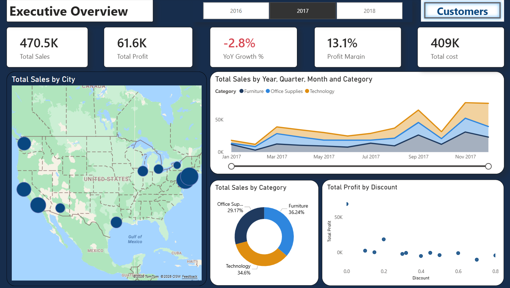
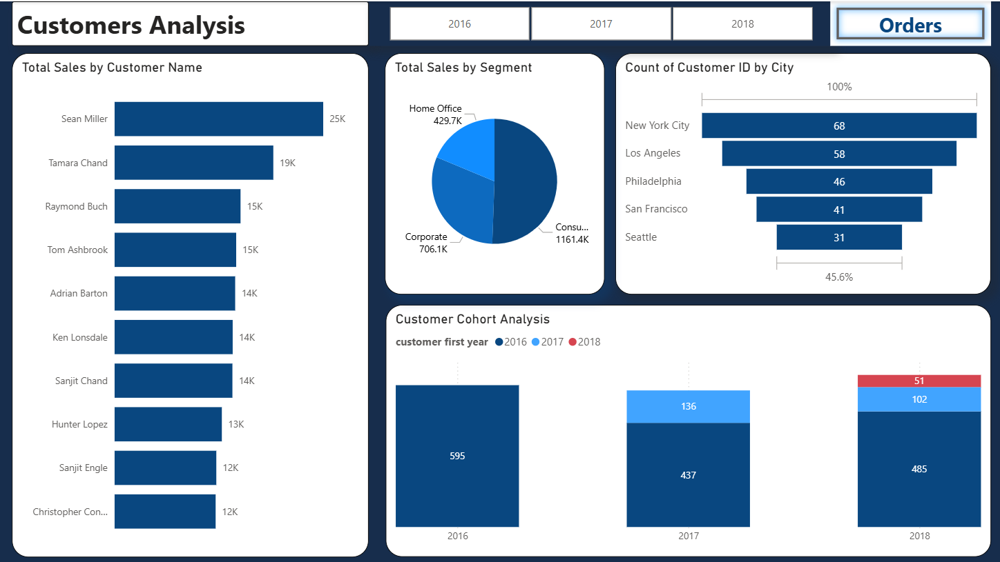
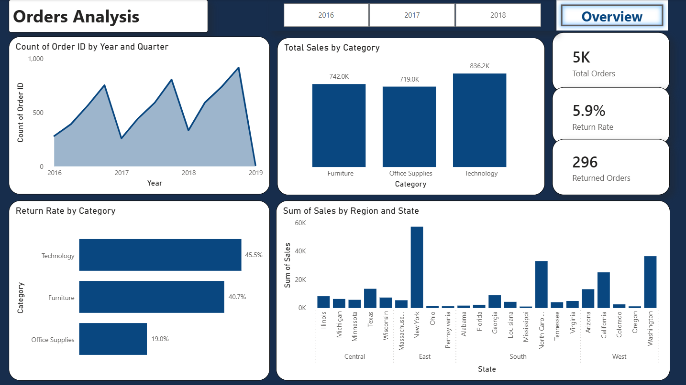
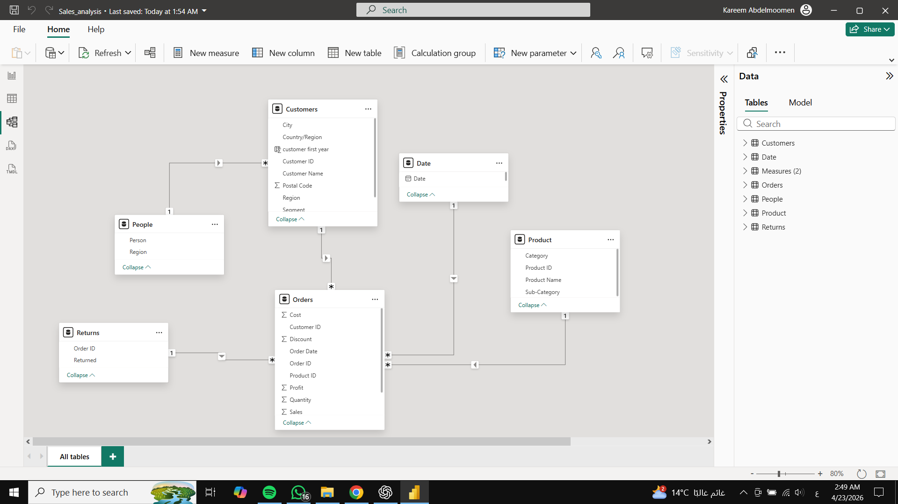

# Sales Analytics Dashboard (Power BI)

## Overview

This project presents an end-to-end sales analytics solution built using Power BI.
It focuses on evaluating business performance, identifying revenue drivers, and uncovering operational risks through interactive dashboards.

---

## Dashboard Preview

---

## Business Objectives

* Analyze overall sales performance and profitability
* Understand customer distribution and segmentation
* Identify high-performing categories and regions
* Monitor return behavior and detect potential issues

---

## Key Insights

* Technology leads in total sales but also shows the highest return rate, indicating a trade-off between growth and product reliability.
* Return rate (5.9%) suggests possible inefficiencies in fulfillment or product quality.
* Sales are concentrated in major cities such as New York and Los Angeles, highlighting geographic dependency.
* Sales experienced a temporary decline in 2017 (-2.8% YoY), suggesting a short-term disruption rather than a consistent downward trend.

---

## Dashboard Features

* Dynamic filtering by year (2016–2018)
* Customer segmentation and cohort analysis
* Sales breakdown by category, state, and region
* Return rate analysis by category
* Profit vs Discount relationship

---

## Data Model

The data model follows a star schema approach:

* **Fact Table:** Orders
* **Dimension Tables:** Customers, Product, Date, Returns, People

This structure improves query performance and ensures scalable analysis.

---

## Tools & Technologies

* Power BI
* DAX
* Data Modeling

---

---

## How to Use

1. Download the `.pbix` file
2. Open it using Power BI Desktop
3. Explore the dashboard using filters and visuals

---

## Author

**Kareem Abdelmoomen**  
Data Analyst | Power BI Developer  

🔗 [LinkedIn](https://www.linkedin.com/in/kareem-ahmed-abdelmoomen)
